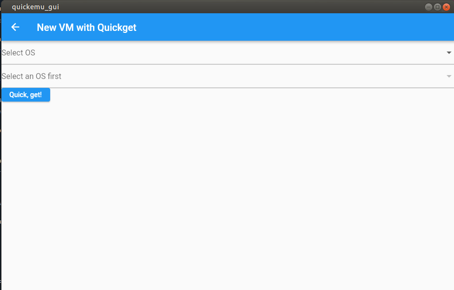
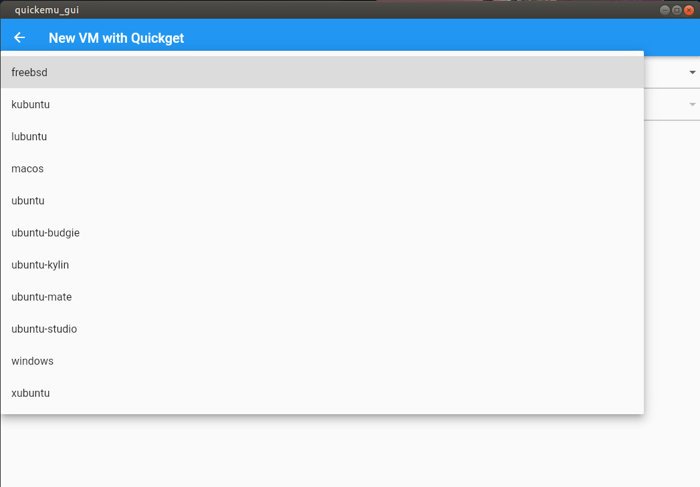
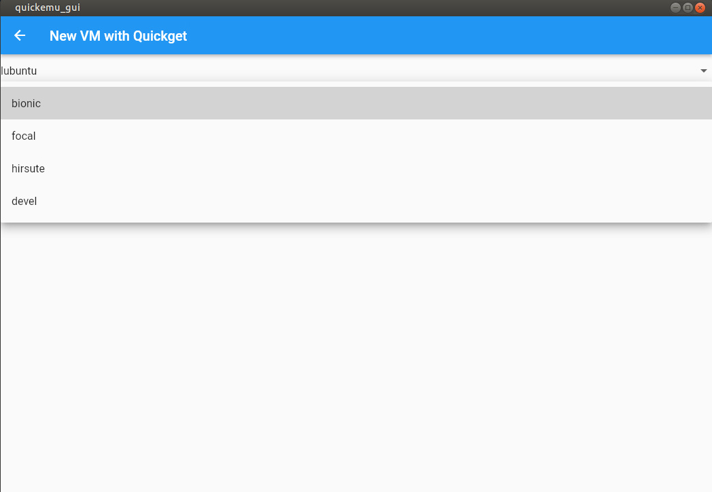
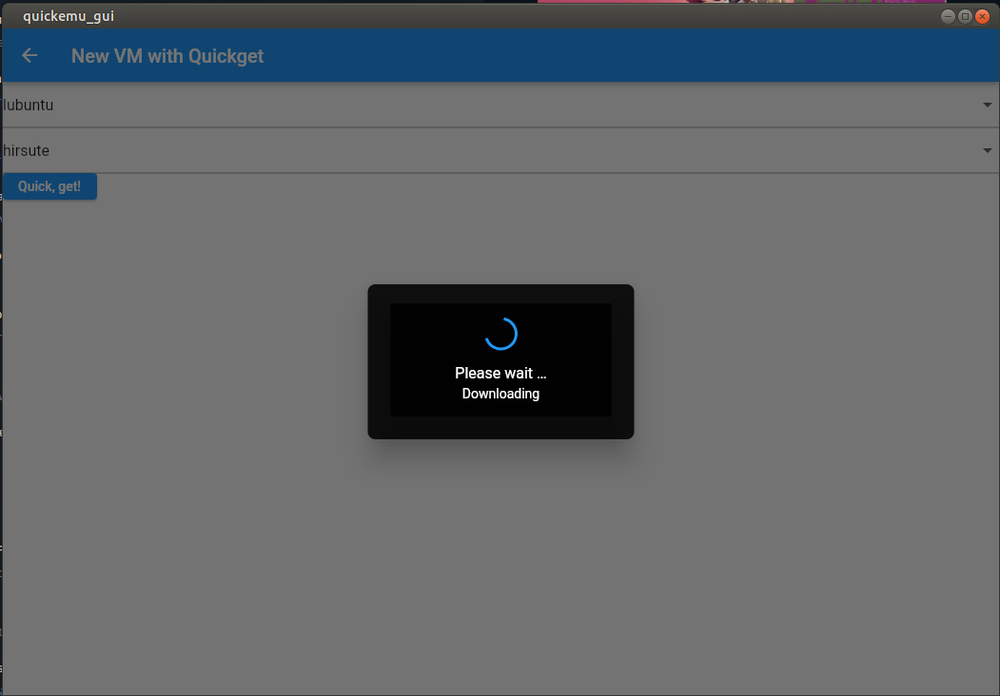
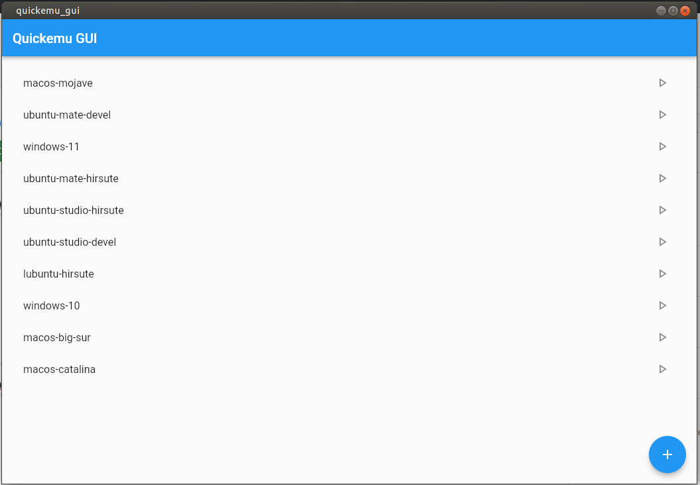

# quickemu_gui

A GUI for [Quickemu](https://github.com/wimpysworld/quickemu)

Provides an interface for setting up new VMs with Quickget, starting and stopping existing VMs.

Written in Flutter.

## Build

* [Set up Flutter](https://ubuntu.com/blog/getting-started-with-flutter-on-ubuntu)
* Clone this repository: `git clone https://github.com/marxjohnson/quickemu_gui.git`
* `cd quickemu_gui`
* Run in debug mode: `flutter run -d linux`
* Build and run: `flutter build linux` - this will place the binary in build/linux/x64/release/bundle

## Run
Build or [download](https://github.com/marxjohnson/quickemu_gui/releases/) the quickemu_gui binary.

Run `quickemu_gui` from the directory where you have, or want, quickemu VMs to live.

The app will find any quickemu config files, detect whether the associated VMs are running, and
display a list. 

VMs can be started or stopped using the "Play" button on the list. VMs that
are currently running will have a green "Play" button.

New VMs can be added using `quickget` but tapping the "+" button. 

Select the OS and release, 
 

then
press the "Quick, get!" button. 

Wait for the OS image to download, and it will be added to your
list.
